# Drifting Ireland
## A website built to highlight the popularity of drifting in Ireland, history, events and driver information.
### Aurelijus_5P

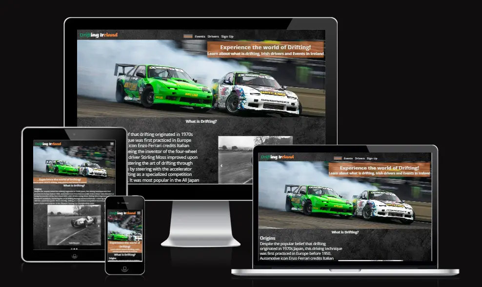

## **[Live site](https://aurelijusjarasius.github.io/drifting-ireland/)**

## **[Repository](https://github.com/AurelijusJarasius/drifting-ireland/)**

## Table of Contents

 1. [ UX ](#ux)
 2. [ Features ](#features)  
 3. [ Future Features ](#future)  
 4. [ Technology used ](#tech) 
 5. [ Testing ](#testing)  
 6. [ Bugs ](#bugs)  
 7. [ Deployment](#deployment)
 8. [ Credits](#credits)
 9. [ Content](#content)  
 10. [ Acknowledgements](#acknowledgements) 

## UX

### Pre-project planning
When choosing a project I thought of things that I am interested in and passionate about. This has led be to drifting as there aren't a lot of websites like this for Irish drifting specifically.

I then researched different websites which contain information on Irish drifting, events and drivers:
- https://www.irishdriftchampionship.com/
- https://dm.gp/
- https://shop.driftgames.life/ 
- https://www.lzworldtour.com/ 
- https://www.juiceboxforyou.com/

This has led me to the conclusion that while there is a lot of information out there, it takes some time to scroll through all the websites and find the information you're after. Therefore I decided to build a website which hosts all relevant information in one place.

## UX Design

### To identify the best way forward for my project, I started looking at the user and business requirements for this type of website

## User Stories
> As a new user I want to learn what is drifting

> As a user I want to find event calendar

> As a user I want to learn about drivers

> As a user I want to be able to get newsletters

## Owner
> As an owner I want to inform about drifting

> As an owner I want to share event details

> As an owner I want to share driver bio

> As an owner I want to share updates about events and drivers

## Scope Plane
> Website should have consistent navigation pane across all devices

> Website should have a hero message so the users understand what the website is about

> Website should detail information about drifting, it's origins and drifting in Ireland

> Website should contain event calendar

> Website should contain Irish driver details

> Website should contain newsletter sign uo option

## Structure Plane
> Website will contain 4 pages: Home, Events, Drivers, Sign Up

### Home Page
> Navigation with links

> Hero message

> Origins of drifting and images of fathers of drifting

> Technicalities of drifting & a video explaining it

> Roots of drifting in Ireland and when did it become popular

> Call to action to sign up to a newsletter

### Events Page

> Irish Drift Championship calendar

> Drift Masters European Championship calendar

> LZ World Tour calendar

### Drivers Page

> James Deane high level bio

> Jack Shanahan high level bio

> Conor Shanahan high level bio

> Duane Mckeever high level bio

### Sign Up Page

> Form to sign up for a newsletter

## Skeleton Pane

### Home Page
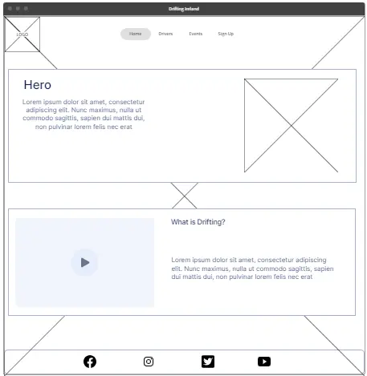

### Events Page

### Drivers Page

### Signup Page
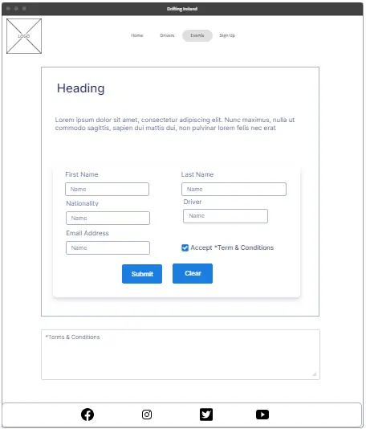

> Design of the website is meant to be simple and provide relevant information without any clutter. As I worked through the project, I had to change the design as it did not look how I wanted. I had to change the background and reorder the content.

> Initially I chose an image of a car as a background, however the image was bright in color which made it difficult to read text. When added in shading around text, the website did not look right. I opted for a dark charcoal color background with colours coming in from logo and images.

### Colours
> I decided that the best way forward will be to keep colours of text and background plain and simple with images providing colour.

> This also meant that with a dark background images had much more visual impact to the end user

#### Fonts

- Briem Hand
- Open Sans

#### Colours

> Text colour kept to a single colour. Logo and box shading colours used where taken from the logo colours to keep colouring to a minimum

- #FFFFFF
- #FF883E
- #DFE6E6
- #169B62

# Features

### index.html

#### Navigation Bar
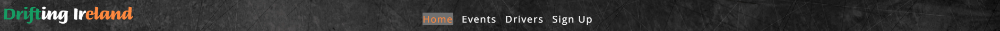
> Navigation bar consists of 4 links in the center of the page

> For mobile use navigation bar shrinks to burger icon

#### Hero Section
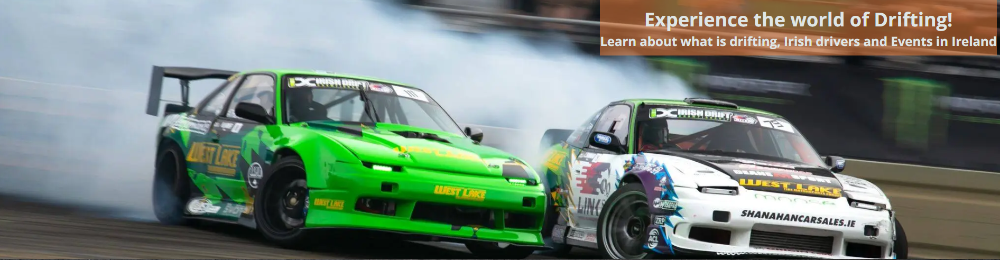

> Image with a flex box overlay. This section is intended to draw attention the the image as not many people are familiar with what dirfting is. It serves the purpose of both image content and explanation on what drifting is.

#### Origins Section
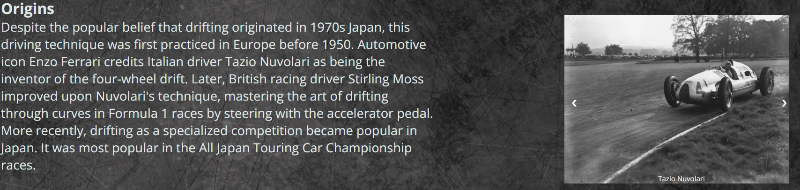

> Text explaining origins and a slideshow containing images of the mentioned drivers. This section is intended to give a brief history lesson on where drifting comes from. Images in the slideshow give an impact to how far drifting dates back to.

#### Technical Bit Section
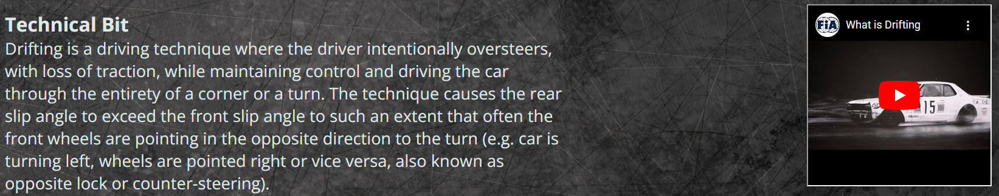

> Text explaining technical (borring) bit of drifting and an iframe video to youtube. Intention here is to explain how drifting works in theory. It is not the most exciting part so a video acompanies the text to make it more interesting.

#### Roots in Ireland Section
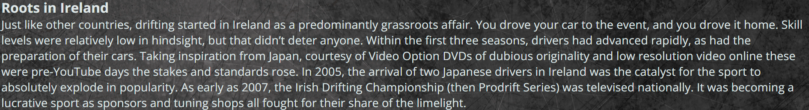

> Text explaining roots of drifting in Ireland with an image underneath. The intention of this section is to showcase when drifting has become popular in Ireland.

#### Call to signup Section
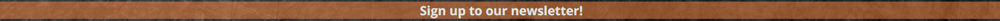

> Bar across the page with a call to action. This links to the sign up page. The intention is to get people to sign up and build a database for potential future features.

#### Footer with social media links
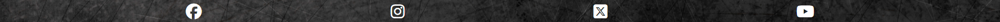

> Footer used to showcase social media icons. Clicking on the icons will redirect to external pages in a new tab.

### events.html

#### Event Calendar
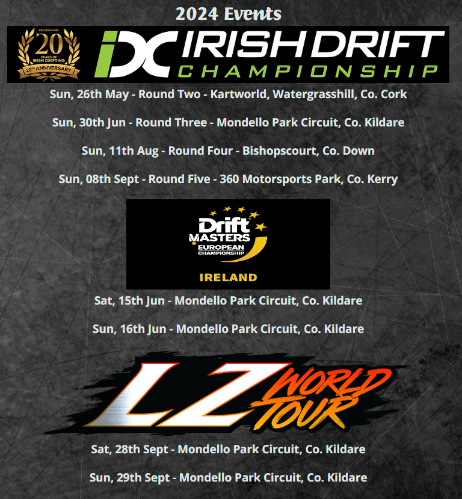

> Images of the competition logos

> Event calendar under each competition logo

### drivers.html

#### Irish Drivers
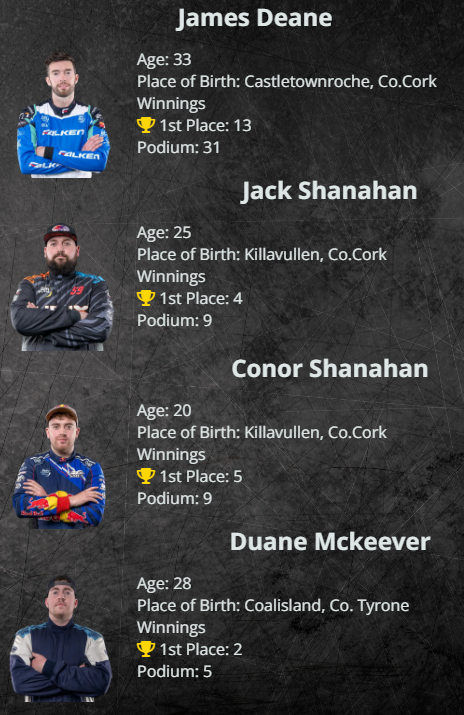

> Picture of 4 most famous drivers in Ireland. Basic bio information. Age, place of Birth and winnings to date.

### sign-up.html

#### Sign Up form
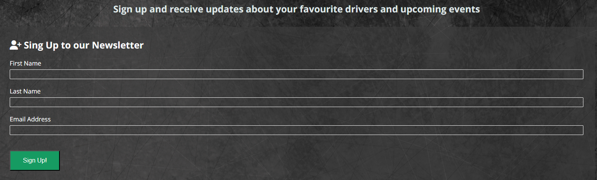

> Basic sign up form with email validation. Name, Last Name & email address.

# Future Features
### Home Page
> Additional section with videos from main figures in drifting community

> Additional section with ways on how to get involved

### Events Page

> Embed google maps to each event location

> Add sections for upcoming and past events

> Link logos to external websites of the competitions

> Add an option to purchase tickets direct from the website for upcoming events

### Drivers Page

> Add links to drivers social media platforms

> Add more information about drivers, including videos of highlight reels

> Add links to drivers merch shops

### NEW Page - Community

> Add sections for various communities arround Ireland

### Sign Up Page

> Add more detail to the form, to gather more data and customize newsletters
- Competition Preference
- Driver Preference
- Competitor or Spectator

# Testing
> Majority of the testing has been conducted manually by myself and a few relatives to ensure the site is useable, responsive and it's easy to navigate

### Testing Phase
#### Testing for links and form
| Test | Expectation | Result |
|--|--|--|
All links on navigation bar | 1. Logo = Redirect to index.html 2. Home = Redirect to index.html 3. Events = Redirect to events.html 4. Drivers = Redirect to drivers.html 5. Signup = Redirect to sign-up.html | Pass |
Sign up to our newsletter banner on the bottom of the page | Redirect to sign-up.html | Pass |
Footer social media links (external links) | 1. Facebook Icon = New tab, redirect to facebook 2. Instagram Icon = New tab, redirect to instagram 3. X Icon = New tab, redirect to X 4. Youtube Icon = New tab, redirect to youtube | Pass |
Sign up form | User prevented from entering email address without @ | Pass |

#### Testing for responsiveness
| Test | Result |
|--|--|
Home page, about, portfolio, contact us displays correctly on screens less than 769px | Pass |
Home page, about, portfolio, contact us displays correctly on screens larger than 992px | Pass |

#### User Testing
| Test | Result |
|--|--|
Navigate to to sign up to our newsletter and sign up to the newsletter | Pass |
Navigate to the bottom of the page and navigate to facebook | Pass |
Find how many winnings does Conor Shanahan have | Pass |
Find when is the next Drift Masters event in Ireland | Pass |

## Google Lightouse Testing

### index.html
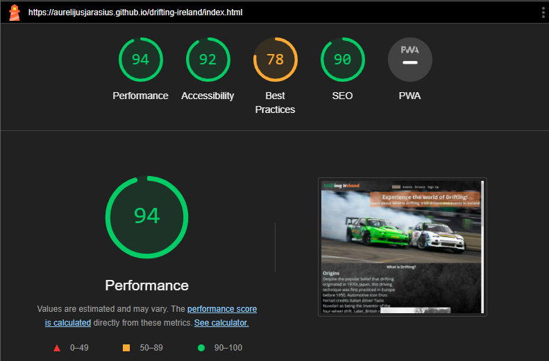

### events.html
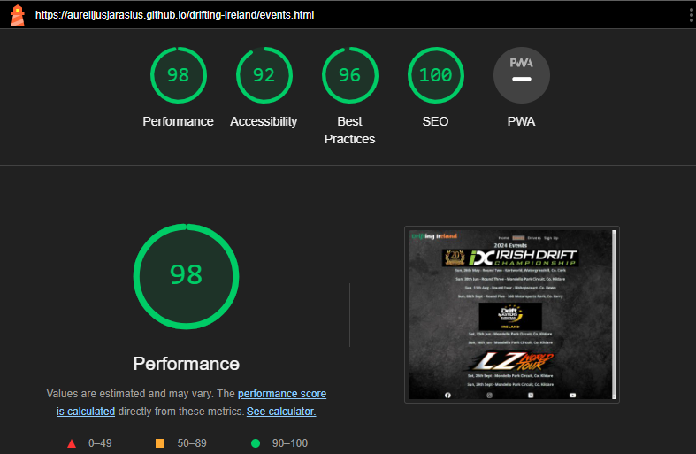

### drivers.html

### sign-up.html
